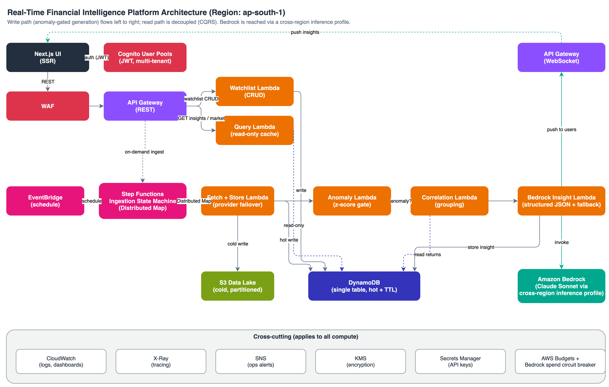
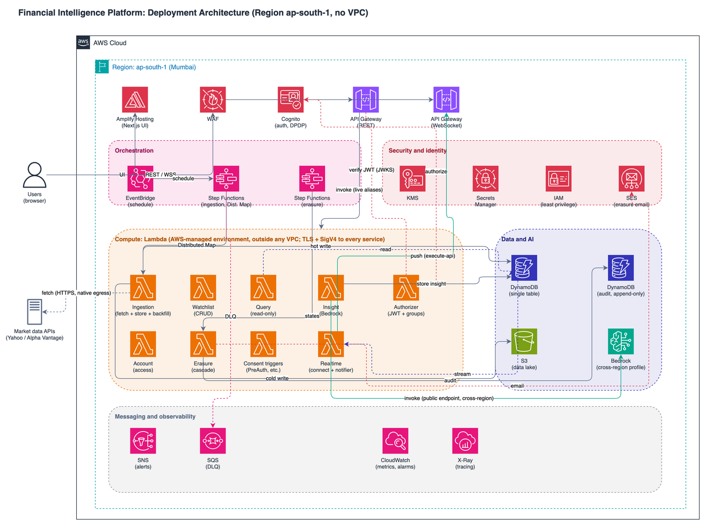

# Financial Intelligence Platform

A serverless platform that ingests real-time NSE/BSE market data, detects statistical
anomalies, groups correlated tickers, generates cross-ticker LLM insights via AWS Bedrock,
and pushes them to authenticated users in real time. Region ap-south-1, Java 25 + Spring
Cloud Function on Lambda, AWS CDK (Java) for infrastructure.

> Current state: scaffold. The authoritative design lives in [`docs/spec.md`](docs/spec.md);
> this README summarizes it.

## Architecture



Deployment view (AWS resources: VPC, private subnets, VPC endpoints, and the managed services):



Two entry points and a CQRS split between generation (write) and serving (read):

- Write path: EventBridge (or on-demand API) starts a Step Functions Distributed Map over the
  distinct union of users' watchlists, fetches and stores each ticker (DynamoDB hot + S3 lake),
  runs a z-score anomaly gate, resolves correlation grouping, then calls Bedrock (cross-region
  inference profile, structured JSON with a rule-based fallback), stores the insight, and pushes
  it over WebSocket.
- Read path: API Gateway to the Query Lambda serves the latest cached insights and market data;
  reads never invoke Bedrock, keeping p99 low.
- Identity and governance: Cognito multi-tenant auth with DPDP consent, purpose-limiting groups,
  right-to-access and right-to-erasure, and an append-only audit trail. See the
  [governance flow](docs/assets/financial_intelligence_platform_dpdp_governance.drawio.png) and
  [`docs/architecture.md`](docs/architecture.md).

## Stack

| Layer | Technology | Why |
|---|---|---|
| Infrastructure | AWS CDK (Java) | Type-safe IaC |
| Lambda runtime | Java 25 + Spring Cloud Function | SnapStart removes cold start |
| Orchestration | Step Functions (Distributed Map) | Fan-out, retry, DLQ, visual history |
| Scheduling | EventBridge | Market-hours-only cadence |
| AI inference | Bedrock Claude Sonnet (cross-region profile) | Managed LLM reachable from ap-south-1 |
| Identity | Cognito (multi-tenant, DPDP) | Auth, consent, groups, erasure |
| Hot storage | DynamoDB (single-table) | Sub-ms reads, TTL expiry |
| Cold storage | S3 | Date-partitioned for Athena |
| Delivery | API Gateway REST + WebSocket | Cached reads, live insight push |
| Observability | CloudWatch + X-Ray | Traces, metrics, alarms |
| CI/CD | GitHub Actions | Dev auto-deploy, prod manual gate |

## Project Structure

```
financial-intelligence-platform/
├── infrastructure/                      # AWS CDK (Java)
│   └── src/main/java/dev/engnotes/platform/
│       ├── FinancialPlatformApp.java
│       └── stacks/
│           ├── DataStack.java            # KMS, DynamoDB table + audit table, S3, SNS (persistent)
│           ├── NetworkStack.java         # VPC, NAT, VPC endpoints (ephemeral)
│           ├── SecurityStack.java        # Cognito pool, groups, MFA, postConfirmation trigger
│           ├── IngestionStack.java       # EventBridge, Step Functions, Lambdas, DLQ
│           └── QueryStack.java           # API Gateway, query/watchlist/consent/dsr Lambdas, authorizer, alarms
├── functions/
│   ├── ingestion-function/              # dev.engnotes.ingestion: fetch + store
│   ├── insight-function/               # dev.engnotes.insight: Bedrock inference
│   ├── query-function/                 # dev.engnotes.query: API serving
│   ├── watchlist-function/             # dev.engnotes.watchlist: watchlist CRUD (consent-gated)
│   ├── authorizer-function/            # dev.engnotes.authorizer: Cognito JWT + group authz
│   ├── consent-function/               # dev.engnotes.consent: DPDP consent + audit
│   └── dsr-function/                   # dev.engnotes.dsr: DPDP data-subject rights (export + erasure)
├── docs/                               # spec, architecture, diagrams (authoritative)
├── .github/workflows/deploy.yml        # CI/CD: build, dev, prod (manual gate)
└── pom.xml                             # Maven multi-module reactor
```

The DPDP Security/compliance work from `docs/spec.md` is built: Cognito groups + MFA, consent
triggers and gating, an append-only audit table, and right-to-access / right-to-erasure endpoints.
The current stacks are Data, Network, Security, Ingestion, and Query.

## Getting Started

### Prerequisites
- Java 25 (Amazon Corretto; pinned in `.sdkmanrc`, run `sdk env`)
- Maven (use the bundled `./mvnw`)
- Node.js with the AWS CDK CLI (`npm install -g aws-cdk`)
- An AWS account with Bedrock model access enabled

### Build
```bash
./mvnw clean package        # build + test all modules
./mvnw spotless:apply       # format before committing
```

### Deploy (from infrastructure/)
```bash
cdk synth  --context env=dev
cdk deploy --all --context env=dev
```

## Documentation
- [`docs/spec.md`](docs/spec.md): authoritative specification
- [`docs/architecture.md`](docs/architecture.md): diagrams and request flows
- [`CONTRIBUTING.md`](CONTRIBUTING.md): how to build, test, and contribute
