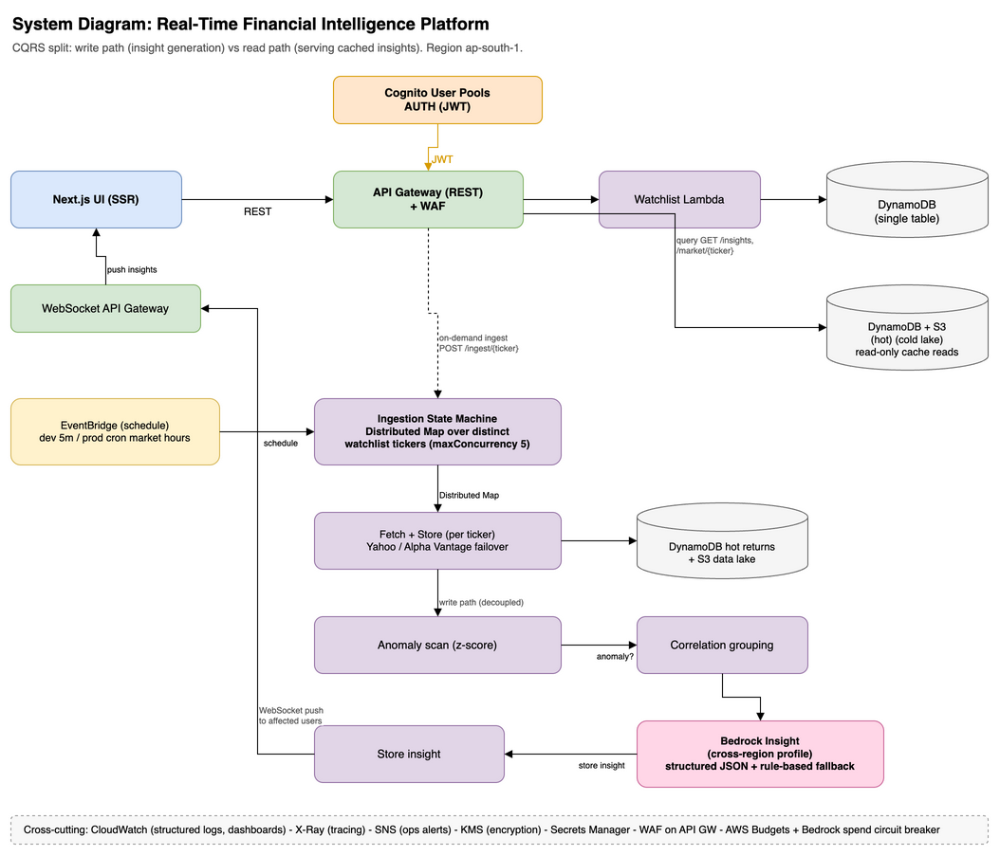
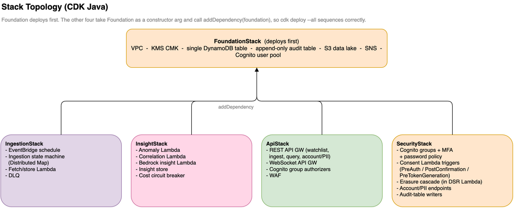
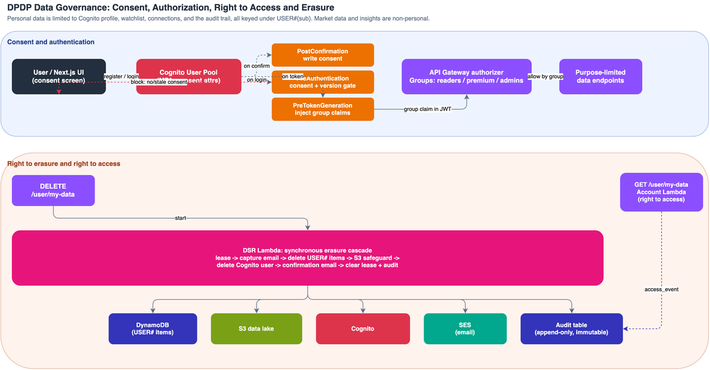

# Architecture

Resolved architecture for the Real-Time Financial Intelligence Platform.
Authoritative narrative lives in [`spec.md`](./spec.md); this file is the diagram-first view.

Region: ap-south-1 (Mumbai) for all stateful and compute resources. Bedrock is reached from
ap-south-1 via a cross-region inference profile.

> Source: [`financial_intelligence_platform_architecture.drawio`](./assets/financial_intelligence_platform_architecture.drawio)
> is the canonical editable diagram (diffs cleanly in git). The PNG above and the
> [SVG](./assets/financial_intelligence_platform_architecture.drawio.svg) are exports and also embed the XML.
> Edit the `.drawio`, then re-export both via the draw.io CLI.

## System Diagram

Two ingestion entry points with distinct purposes, and a CQRS-style split between the write
path (insight generation) and the read path (serving cached insights).

> Source: [`financial_intelligence_platform_system_diagram.drawio`](./assets/financial_intelligence_platform_system_diagram.drawio)
> is the canonical editable diagram. The PNG above and the
> [SVG](./assets/financial_intelligence_platform_system_diagram.drawio.svg) are exports that embed the XML.

## Request Flows

Write path (generation, anomaly-gated):
EventBridge schedule (or on-demand `POST /ingest/{ticker}`) starts the ingestion state
machine. A Distributed Map fans out over the distinct union of all users' watchlist tickers.
Each item fetches via the provider abstraction (Yahoo or Alpha Vantage with failover) and
dual-writes a hot point to DynamoDB and a cold object to the S3 lake, updating the per-ticker
z-score baseline. When a z-score anomaly fires, the correlation grouping for that ticker is
resolved and the insight Lambda assembles cross-ticker context, calls Bedrock through the
cross-region inference profile, validates the structured JSON (falling back to rule-based on
throttle, invalid output, or an open cost circuit breaker), stores the insight, and pushes it
over WebSocket to users whose watchlist intersects the insight's tickers.

Read path (serving, CQRS):
`GET /insights` returns the latest cached insights touching the caller's watchlist;
`GET /market/{ticker}` returns the latest hot market data. Neither read invokes Bedrock, so
read p99 stays low and the path can use provisioned concurrency and API Gateway caching.

## Deployment View (AWS Resources)

The deployment diagram maps the design onto the AWS resources actually provisioned, grouped by
AWS Cloud and Region (ap-south-1). All Lambdas run in the AWS-managed environment outside any
VPC and reach the managed services (Cognito, API Gateway, Step Functions, EventBridge, DynamoDB,
S3, Bedrock, SNS, SQS, SES, KMS, CloudWatch, X-Ray) over their public regional endpoints with
TLS and SigV4-signed requests. Bedrock is invoked through a cross-region inference profile.

*The diagram below predates the VPC removal and still shows the earlier VPC grouping; a refreshed
export is pending.*

> Source: [`financial_intelligence_platform_deployment.drawio`](./assets/financial_intelligence_platform_deployment.drawio)
> is the canonical editable diagram (official AWS icons). The PNG above and the
> [SVG](./assets/financial_intelligence_platform_deployment.drawio.svg) are exports that embed the XML.

### Network Posture

All Lambdas run outside any VPC. Every dependency is a public-API AWS service reached over TLS
with SigV4-signed requests, and the two functions that call the external market-data provider
(Yahoo Finance) use the internet egress the managed Lambda environment provides natively. The
security perimeter is per-function least-privilege IAM, KMS encryption at rest, and Cognito
authorization at the API edge.

An earlier iteration ran the data-path Lambdas inside a 2-AZ VPC with a NAT gateway, free
S3/DynamoDB gateway endpoints, and a Bedrock PrivateLink interface endpoint. It was removed once
measured: the NAT dominated the platform's always-on cost while adding no inbound protection
(Lambda functions expose no inbound network surface regardless of placement) and no real egress
restriction (the private subnets' default route granted full outbound internet through the NAT).

## Stack Topology (CDK Java)

Foundation deploys first. Ingestion, Insight, and API stacks take Foundation as a constructor
argument and call `addDependency(foundation)`, so `cdk deploy --all` sequences correctly.

> Source: [`financial_intelligence_platform_stack_topology.drawio`](./assets/financial_intelligence_platform_stack_topology.drawio)
> is the canonical editable diagram. The PNG above and the
> [SVG](./assets/financial_intelligence_platform_stack_topology.drawio.svg) are exports that embed the XML.

## Data Governance (DPDP) Flow

The platform treats DPDP Act 2023 compliance as first-class: consent gating, purpose-limiting
Cognito groups, right-to-access, right-to-erasure, and an immutable audit trail. See
[`spec.md`](./spec.md) section 11 for the full narrative.

> Source: [`financial_intelligence_platform_dpdp_governance.drawio`](./assets/financial_intelligence_platform_dpdp_governance.drawio)
> is the canonical editable diagram. The PNG above and the
> [SVG](./assets/financial_intelligence_platform_dpdp_governance.drawio.svg) are exports that embed the XML.

Consent flow: registration shows a consent screen; on accept, the PostConfirmation trigger
writes `consent_given`, `consent_timestamp`, and `consent_version` to Cognito. Every login runs
PreAuthentication, which blocks access if consent is missing or the version is stale (forcing
re-consent). PreTokenGeneration injects the user's group claim (`readers` / `premium` /
`admins`) into the JWT, which the API Gateway authorizer enforces per endpoint.

Erasure flow: `DELETE /user/my-data` starts a Step Functions workflow that marks the profile
`deletion_pending`, batch-deletes all `USER#{sub}` items (watchlist, connections, profile),
runs the S3 user-tagged safeguard delete, deletes the Cognito user, emails confirmation, and
writes a permanent erasure record (hashed sub, no PII) to the append-only audit table.
Right-to-access (`GET /user/my-data`) aggregates Cognito attributes plus all `USER#{sub}` items
and logs an `access_event`.

For component responsibilities, the single-table data model, tunable defaults, security,
observability, cost guardrails, and the build sequence, see [`spec.md`](./spec.md).
